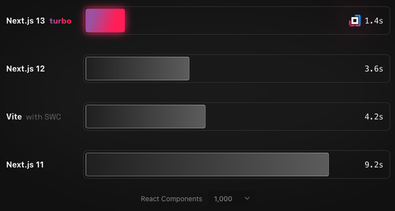

#  Vite

Vite is a JavaScript frontend build tool that is packed full of quirks that make it popular. It is meant to be the next evolution of front-end tooling and streamlines the compiling/bundling process. The word _Vite_ is french, it is pronounced as "_`veet`_." The word means "quick", and that's what this tool is.

## What problem is this tool trying solve?

The concept of _bundling_ has been around for a while now. Tools such as Vite search/crawl across code written by developers that are modular. Then takes that code and bundles it, which is essentially stitching all the code together so that the browser can run JavaScript applications. The process of building applications has become more complex, and this is due to how modularity is employed with JavaScript code. Vite sought to address these issues and increase load performance by employing the latest JS and browser capabilities.

### Slow Server Starts

Development servers are important for creating applications, it is how developers see code on screen live. Spooling up a server can take a while sometimes because a bundler tool has to serve up an application on the spot--in other words, _cold starting_ a server. Sometimes when an application has a vast modular codebase or many dependencies that are required, cold starts can take a while to complete. Because a dev build has to be bundled so that a browser could efficiently run it.

Vite improves development server start-up times by defining two parts of an application: _dependencies_ and _source code_. Both are required for an application to run properly. Dependencies are packages of JavaScript that help applications function. When there are a lot of these bundle times could be prolonged until a server is up and running for development. Vite takes these packages and _pre-bundles_ them in another bundler called [esbuild](https://esbuild.github.io/). Which is written in another programming language that is high-performance compared to JS, which is the language [Go](https://go.dev/). The bundling time for dependencies is dramatically faster using esbuild.

Vite defines source code as JavaScript that is like JSX/TSX Components, CSS/SCSS/SASS, and must be edited often as the application evolves. When a development server starts up with Vite, the source code is handled with ES-module methods (e.g., `import` or `export`). This offloads bundling work to the browser in the end and modules are served on demand and don't bundle the whole codebase in one go like other bundle tools.

## How does it solve the problem? AKA, what makes this tool unique?

Vite is what is known as an "opinionated", which is a tool/framework that has specific features out of the box by design. Meaning, certain features are designed in a way to restrict a developer to build an application that way. Not because it's the best way, but because its the way how the framework functions to solve the problems it addresses. Dev servers and bundle times are important steps in the development cycle. Vite is owning the identity of being exceedingly fast by utilizing ES modules, Hot Module Replacements, and ESBuild. Which makes the bundle and serve times quick, hence the name _Vite_.

## When shouldn't you use this tool?

It's really hard to say when not to use this tool, it's a stellar bundler that makes things quick. Which is so nice for the development experience but it's also nice for performance. Maybe the question to be asking is what application warrants the use of this bundler? Maybe something that has a lot of packages installed that is required and the source code is extensive as well, would require a bundler like Vite.

However, if an application is simple that doesn't have many dependencies or a complex UI library built out of common components methods (e.g., JSX/TSX) and complex CSS. Then a bundler may not be even required at the end of the day, or at least another build tool may be better suited for that use case.

## Name two features you find interesting/useful and explain why they are helpful.

### Hot Module Replacement (HMR)

HMR is an awesome feature that has become common with frameworks. During the development process, one would be working with a codebase and running a server to see their work. Changes to the code will occur that may trigger a reload of the browser. Which limits development time, is tedious, and ultimately annoying. However, with Vite HMR is possible! Meaning any code changes is reflected in real-time by being precise, not losing states, and doesn't trigger reloads.

### NPM Dependency Resolving

Working with modules is important for JavaScript development. We have no choice but to interact with the ES Module system when working with dependencies. Importing files stitches the application together so that it functions properly, but the code is organized and managed cleanly.

```js
import { myLibrary } from "myLibrary/index.js"
```

Imports should like this typically with vanilla JavaScript. However, Vite handles rewrites of package paths and shortens them. There is also a pre-bundling process that ESBuild handles. So that imports look more like this:

```js
import { myLibrary } from "myLibrary"
```

## What other information should someone know before using this tool?

The use of of this tool is vast and is implemented in many other frameworks. So, a developer may have already used Vite with out knowing it. So, using Vite directly without a framework like React or Svelte is possible with Vanilla JS. While still maintining that look at feel of JSX scripting.

Also, this builder tool may be more appropiate for dynamic applications that don't have a lot of static assets. This is commonly used in frameworks that include some sort of server side capabilites.

<br>
<br>

# 

Webpack is a bundler that has been around for a while now but is quality for what it's trying to achieve. The tool is a `static-module bundler`, which means any files that aren't going to be changed later. Static assets will be made available to be served after Webpack bundles a JavaScript application. The tool consists of 6 concepts: Entry, Output, Loaders, Plugins, Mode, and Browser Compatibility--Webpack is supported on browsers that are compatible with ES5 and runs in NodeJS.

- **Entry**: A bundler needs to know which file to start with bundling and building out a "plan" to bundle the rest of the files together. Webpack creates what is known as a _dependency graph_, which is a graph generated by how files depend on each other. The default application entry point file is `./src/index.js`, this could be modified if need be in the `webpack.config.js` file.

- **Output**: After the bundling process there must be an output of files that is available for the browser. Webpack generates an output path and file that holds our bundled application code. This is customizable via the `webpack.config.js` file.

- **Loaders**: Webpack only understands how to work with JS/JSON files. To enable the ability to bundle other file types as well, Loaders are required. These bundle files are other than JS/JSON, such as `.txt` or `.jpg` files.

- **Plugins**: These help handle optimization tasks and management of content. To work with a plugin, you have to import it via CommonJS syntax in the `webpack.config.js` file. Plugins will have options available to customize how the plugin functions within the bundling process.

- **Mode**: This is a configurable parameter in the `webpack.config.js` file. The available options for this parameter are _development_, _production_, and _none_. Depending on the option that is invoked, will dictate the bundler's optimization methods that correspond to a desired environment. For example, a production environment would have higher optimizations done on the bundling process to produce a better product.

## What problem is this tool trying to solve?

The issues with loading JavaScript to the browser can occur in many ways. Typically, including scripts/importing JS files can lead to the network being bottlenecked. Slowing down the browser and making the application sluggish. To avoid this, you could only have one JavaScript file. But then that introduces a butterfly effect of code maintainability and readability. These issues were common to deal with up until NodeJS came out, along with npm and the module system.

Webpack came into existence out of the need to have a bundler that would output JS apps, with extended support for digital media formats and CSS. Load times and application performance can plague browsers and user experience, which was a common issue before NodeJS and module systems. The key objectives for the tool are performance and improving the user experience as a result of that.

## How does it solve the problem? AKA, what makes this tool unique?

Webpack identifies every file in a project as a module, and it tracks each file to generate the `ModuleGraph`. This is important for the bundling process, because each of those tracked modules will be converted into _chunks_, and can be built into _chunk groups_ as well to form JS entry points for an app.

```js
// webpack.config.js example, config files are much more complex.
module.exports = {
  entry: {
    home: "./index.js",
    contact: "./contact.js",
  },
}
```

The entry points configured above are chunk groups. By default, if an entry point is `index.js` the chunk will be named `main`. The bundling process for chunks is how the issue for modules/imported scripts are handled. Depending if a chunk is containing assets that aren't lazy-loaded, chunks will be flagged as an initial chunk--with a corresponding named output file. Chunks that involve some sort of async loading will be flagged as non-initial.

These output files are the result of the bundling process and optimizations that improve overall app performance in the browser.

## When shouldn't you use this tool?

Configuring this tool is seemingly tedious and difficult to manage compared to alternatives. You have to define entry points and chunks as application scales. Tools like Vite don't require as much configuration out of the box and is easy to bundle assets as you create new files for projects. Although, Webpack is great with bundling assets to minimal files to be downloaded via the browser. Does the additional configuration make it worth it? The complexity involved with setting up this bundler is highly involved and requires a greater understanding of how assets/modules work.

## Name two features you find interesting/useful and explain why they are helpful.

### Loaders

Webpack uses tools called _loaders_ that take code and transform it into something else (e.g., transforming source code, like TS to JS). To use a loader, they must be installed on top of Webpack. Once they are installed, they can be configured within the `webpack.config.js` file. Prime examples of this that is SCSS or TypeScript, both of which need to compile down to CSS or JS respectively.

### Module Caching

Resolving modules is important, it's how the bundler knows where modules are located in the directory. Importing modules happens often, especially with the same module across multiple files. Webpack takes that path to the required module, and caches it, so that _parrllel_ requests can be resolved quickly. The longest load time of a module should be the first time, future requests will be resolved quicker since locations are cached.

## What other information should someone know before using this tool?

Dependency Graphs are an important concept to Webpack. This is how modules for applications are tracked and ultimately resolved into chunks as an output, post-bundling. Files typically depend on each other, for instance, an HTML file would depend on some digital media asset as content. These are defined as dependencies, from source code to image files can be tracked to be included for bundling.

The graph starts at the entry point of the application, which is defined within the `webpack.config.js` file. Then builds a graph or maybe a better term would be a _tree_ from that entry point. Starting from the root/entry point and building out a dependency structure. It takes this structure into account during the bundling process and makes it smaller for quick browser load times.

<br>
<br>

#  Turbopack

This is one of the latest bundlers that have been created. So recently in fact, that it is still in Alpha and going under constant changes. But the idea for this bundler is to be the next successor for Webpack, via the use of the Rust programming language. Vercel prides itself on being quick and reliable with its tools for development, they plan to carry this trend with Turbopack.

Written in Rust, which is a high-performance programming language. The bundler is optimized for JavaScript/TypeScript applications specifically and developed by creators of Vercel, NextJS, and even Webpack!

## What problem is this tool trying solve?

The creators are heavily involved with NextJS and they wanted to dramatically improve the speed of how NextJS bundles its modules. The developers also wanted to replace Webpack with a new generation bundler with high-speed capabilities and minimal requests. Akin to bundlers like esbuild, which is built with Go. Also, while improving development server cold starts as well. Building upon what others did with Webpack, Vite, and ESBuild. The creators of Turbopack sought to remedy those issues and introduce the next-generation bundler, developed in-house.

## How does it solve the problem? AKA, what makes this tool unique?

The browser has to handle requests to render applications, these requests are JS files or other assets. If many requests are hitting the network at once, this slows down the browser drastically. Bundler tools are meant to fix that issue, with Turbopack they sought to build upon the popular tools out right now and make it quick while integrating it with NextJS.

### Bundling

The creators of Turbopack argue that bundlers like Vite can hit app scaling issues as modules increase or as more dependencies are required. Even Vite could potentially have slow start-up times when the development server is bundling modules together or as the browser loads modules. Turbopack aims to be similar to Webpack, as bundling happens in the development server so that later on the browser has very minimal requests. But also achieving this with blazing speeds by leveraging the capabilities of the Rust programming language. Optimization occurs later on during the production process or the build phase.

### Incremental Computation

The engine under the hood for Turbopack takes the methodologies of processing speeds to heart and employed them, "do less work or do work in parallel" ([TurboPack](https://turbo.build/pack/docs/why-turbopack)). How it works is the Rust base engined they crafted runs as a _scheduler_, that consists of function calls. The ability to run parallel function calls is present as well. Checking off one of the methodologies of processing speed. The engine has a caching system too. This holds the results of executed functions if they are needed later during the bundling process, this emphasizes the methodology of less work.

The goal for the engine is to do the least amount of work in the quickest way possible. They had to leverage another programming language, which is common.

### Lazy Bundling

Upon start-up of the development server, it only bundles the least amount of modules required to render. Which makes start-up times incredibly fast. The notorious module graph/tree is still created, but the engine only bundles the code that is requested to be rendered. Before, the entire application had to be rendered before being hosted on a dev server for live preview. This was prevalent in NextJS not so long ago. Again, Turbopack was created to help improve NextJS bundling times/speeds.

Now, with the new engine. If the browser only requests a certain code, that code will be served and consumed by the browser. The entire application won't be bundled upon start-up, only what is being requested initially. This is called `Request-Level Compilation`, and this reduces the overall number of requests upon bundling and compiles speeds as well. Their benchmarks are pretty remarkable.



## When shouldn't you use this tool?

This is an _in-house_ tool from Vercel and the creators of NextJS, along with Webpack as too. It was meant to improve their product, NextJS. Which is a full-stack JavaScript framework built upon ReactJS. Heavily married with the Rust programming language to handle the build speeds of JavaScript applications. So, you should only be using this tool with NextJS. Specifically, the NextJS 13 build of the framework.

This tool is very new and is still in alpha. Even the documentation for the NextJS 13 quick start guide mentions not using this in production build apps. Which is another time when not to use this tool. It's still in alpha, things could not function right or not have the proper support across hosting services. For example, AWS Amplify does not support this specific version of NextJS 13.

If you're developing an app that is meant to go to production, using the leading tech is awesome and a cool badge to hold. However, you should be working with the latest tech that is production ready, so that you can deliver production-quality apps. With the proper support on hosting services.

## Name two features you find interesting/useful and explain why they are helpful.

### TypeScript

I'm in love with TypeScript, it helps to script applications in a strict way to limit bugs. It has become more and more popular. Starting with it is daunting at first, but isn't too hard once you get going. Especially with the help of TypeScript Intellisence within VS Code. TurboPack supports .ts files by default, meaning there is no need for further configuration of integrating Typescript within your application. The compiling to JavaScript is handled during the build phase out of the box. Which is awesome and makes it a great way to start learning how to make TypeScript applications.

### Environment Variables

Working with APIs is one of the coolest things to be doing as a JavaScript developer. However, APIs require auth sometimes and you need an API key to be seeded into an HTTP request to fetch/receive data. Frameworks such as NextJS that use Turbopack make the process of hiding API keys super straightforward. Then accessing them as well is just as easy when performing any fetch requests.

This is a common feature in other full-stack frameworks, but it is nice to have this common feature out of the box. Storing keys is done in the environment variables file, typically called `.env`. See below for an example of what this key would look like in that file.

```env
MY_KEY=12345
```

These environment variables can be requested or what is known as `injected` into your code, via `process.env`. This a common way of injecting hidden keys into some code from NodeJS, so that applications can function properly--without exposing them to the world. If wanted to invoke this key in a fetch call, it would look like this:

```js
const fetchData = async () => {
    try {
        const data = await fetch(`/urlPath?key=${process.env.MY_KEY}`)
        return res.json(data)
    } catch (err) {
        console.log(err)
    }
}

export default HomePage function(props) {
    return (
        <button onClick={async () => {await fetchData()}}>Call API</button>
    )
}
```

## What other information should someone know before using this tool?

This is only supported on NextJS 13 right now, specifically an Alpha build version of NextJS 13. Since the creator of this tool is Vercel, there are plans for this to be supported with Svelte/SvelteKit eventually. Other frameworks are outside of the Vercels realm and would require further collaboration between frameworks. But, it is possible and Vercel claims they are in talks about introducing support to other frameworks.

Because of this, you must be ready to learn ReactJS base development and then move up to NextJS. Which is the full-stack framework of ReactJS and is created by Vercel. It's a great opportunity to learn how to build apps with these frameworks and have them for portfolio pieces, but nothing for production should come of this tool, just yet at least.

<br>

---

## Bundle Tool Final Comparisons

Vite, Webpack, and Turbopack all have their places in the community. Each has its pros and cons and deciding which one to use ultimately depends on the type of project you're working with and how you want your app to function in the browser. This in the end impacts how the app runs in a user's browsers and it also impacts the development cycle.

**`Vite`** is a unique tool since its purely leverages modern JavaScript modules in a browser and blends the bundling process with another very fast programming language. However, this part of the process is only handled on modules/dependencies that don't change often. Source code is bundled and served dynamically as a browser requests it to be served. Making the dev server starts very quickly and bundle process efficient too. This bundler tool is integrated with all the frameworks I use, and I'm used to how to work with it. Everything about it is snappy and bundling is easy to follow. This is great for Svelete or NextJS.

**`Webpack`** opts to tackle the performance issue by bundling code in the least amount of files possible. But it is highly configurable as well, especially with custom loaders that help with bundling all sorts of files. Even though it is primarily a JS bundler, bundling files ready for the web such as digital media is important. The fact that this is highly configurable, makes it a unique tool that can be used to accomplish making production-ready web apps. But since this is a highly configurable bundler, it is somewhat tedious to set up and get running properly. You'll have to think about custom loaders and plugins to properly bundle files. If a framework has this integrated into my creating an app for development, I would use it. Because some configurations would be already set in stone.

**`Turbopack`** is the new kid on the block and trying to outclass its predecessors, such as Webpack. The creators of the bundler wanted to migrate away from JS tools to focus on speedy tools for JavaScript development. Leveraging other programming languages for the use of JS applications has become more and more prevalent. This bundler though is in early alpha stages and is propriety essentially--there are goals to allow this to be used with frameworks other than NextJS. It may only ever be for NextJS because it is built to improve the framework. Meaning there are only stats of bundling/compiling times on the version of NextJS. You can't compare it to other frameworks and see if improves SvelteKit for example. This should only be used with NextJS because thats the only choice! It's a great opportunity though to work on the bleeding edge of JS development with the help of modern tools for the most modern frameworks.

---

From the three tools, you choose to compare and contrast, choose one, and create a sample repo to show off the tool's features.
In your sample repo, develop a very basic example app to show off the features of the tool. Do not use any of the examples in the tools documentation.
